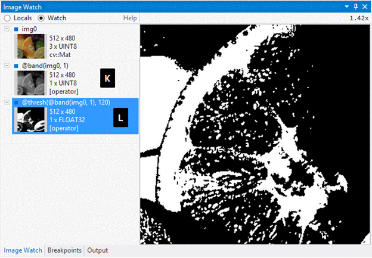

Image Watch is a watch window for viewing in-memory images and matrices when debugging native C++ code.

The current version has built-in support for OpenCV image types (e.g. cv::Mat) and Eigen matrices. To enable user-defined image types please refer to the Image Watch documentation.

This version works with Visual Studio 2026.

Quick Start: Simply break in the debugger and select View > Other Windows > Image Watch. Alternatively, click on the magnifying glass icon next to an image variable in your Locals window or on the debugger Data Tip.

This extension is based on the official Image Watch code, which Microsoft has open-sourced in April 2026. As the official Microsoft repository is archive-only (Microsoft discontinued the extension), development has continued in the fork at https://github.com/patrikhuber/image-watch. In this latest release (1.1.0), two things were fixed/added:
- 1-Channel Pseudo Color displaying "n/a" was fixed
- Support to visualise Eigen matrices (row and column major) was added out-of-the-box

Supported target platforms: Windows on x86/x64.

